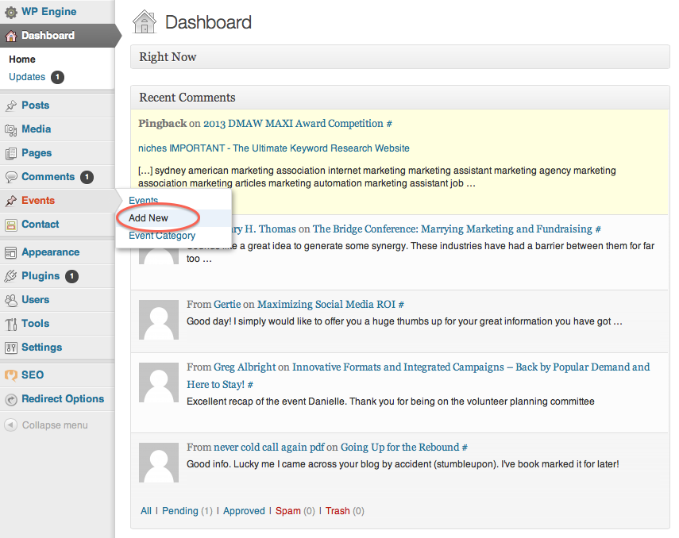
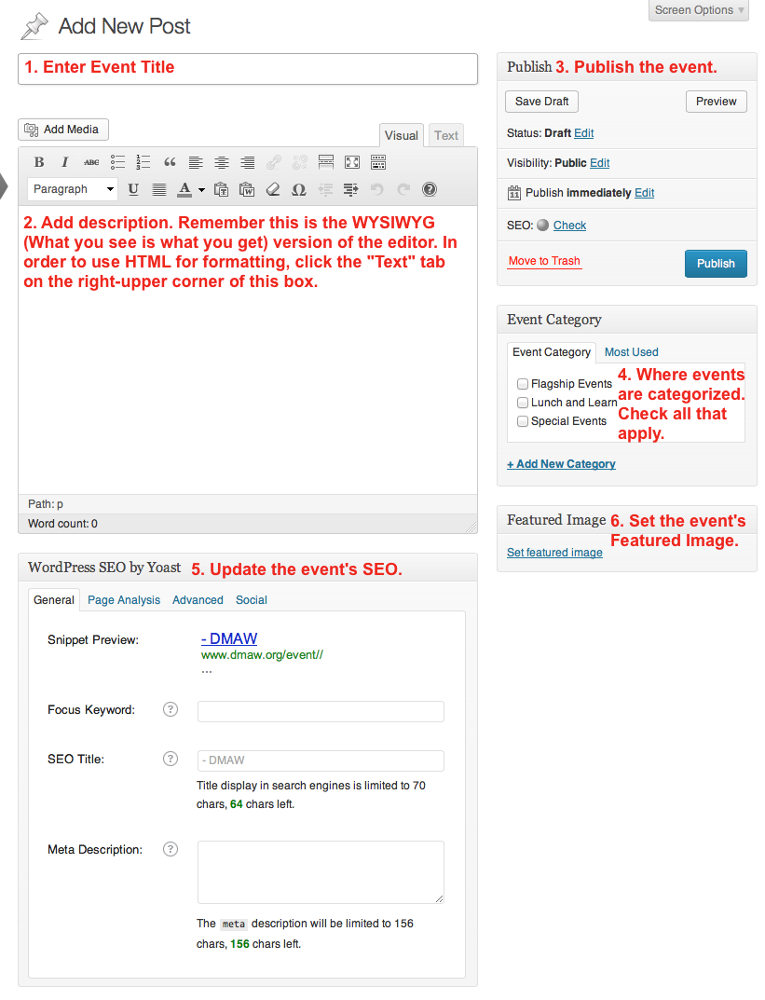
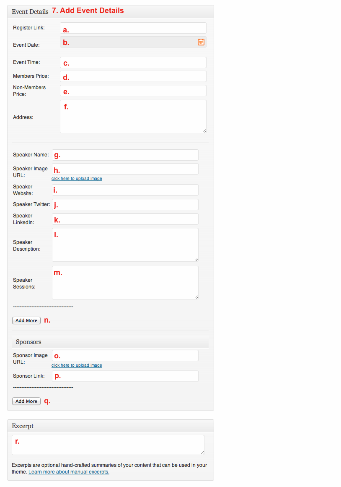

DMAWDOCS
========

DMAW Website Documentation

# I. Add a New Event

**In order to create an event, log into Wordpress with your username and password at http://www.dmaw.org/wp-admin/. Then click "Add new" under "Events" pictured below.**

**Once you create an event, the following screen will appear. Follow the steps to create an event.**

      1. **Enter Event Title** - Add the name of the event in this field. If it is a Lunch and Learn, be sure to include that in the beginning of the title.
      
      2. **Add Description** - Add the description of the event here. You may have to use some HTML under the "Text" tab in order to create tables for different level sponsorships.
      
      3. **Publish/Save the Event** - This is where events are saved as drafts, can be previewed, and finally published. 
      
            * The "Status" indicates whether the event is in draft, pending review, or published status.
            * The "Visibility" indicates whether the event is public, password protected, or private. Events will most likely always be public.
            * The "Publish" field can be edited to publish the event at a date in the past, immediately, or in the future.
            * While creating the event, it's important to click "Save Draft" and "Preview" along the process to make sure everything saves and looks correct.
            * Once the event is ready to be published (after you finish the following steps), you'll click the "Publish" button.
            
      4. **Categorize the Event** - This is where events are categorized. This makes it so the web visitor can separate the events its type.
      
      5. **Update the Event's SEO** - Filling out this section with relevant words will help with the Search Engine Optimization for the event page. 
      
      6. **Set the Event's Featured Image** - Add a featured image for the event. This will be the image that shows up as the banner for the event and if the event is the featured event, will show up on the DMAW homepage. The image should be approximately 3000px x 850px.

7. **Add Event Details**

      a. Add the event registration link here.

      b. Choose the event date here.
      
      c. Add the event time here **to be consistant use the #AM-#PM format*.
      
      d. Add the price for members here **to be consistant use $## format*.
      
      e. Add the price for non-members here **to be consistant use $## format*.
      
      f. Add the address of the event's location here **you can put the name of the location before the address, however DO NOT add any content after the address (this will cause the map to be thrown off).*
      
      g. Add the name and position of the event's speaker here.
      
      h. Add the speaker's image url here. If there is no image available for the speaker, use the speaker image placeholder by copying and pasting "/wp-content/uploads/2013/09/Speaker.png" into the field.
      
      i. Add the speaker's website url, if available.
      
      j. Add the speaker's twitter handle, if available.
      
      k. Add the speaker's LinkedIn url, if available.
      
      l. Add the speaker's description here.
      
      m. Add the speaker's session name and description here.
      
      n. Add multiple speakers by clicking "Add More" and repeating steps 7g-7m.
      
      o. Add the sponsor's image url here. **Use a gif or png file in order to keep the transparent background.*
      
      p. Add the url for the sponsor's website here.
      
      q. Add multiple sponsors by clicking "Add More" and repeating steps 7o-7p.
      
      r. Add an excerpt that will be shown on the homepage if the event is a "Featured Event" **If this is not filled out, the description from Step 2 will be shown.*

      
# II. Edit an Image
