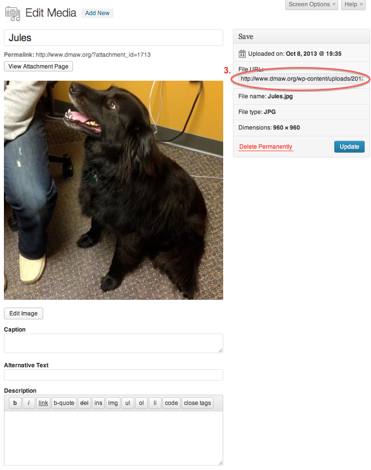

DMAW Website Documentation
========

**In order to add any changes to the DMAW website, log into Wordpress with your username and password at http://www.dmaw.org/wp-admin/.**

# I. Add a New Event

**In order to create an event, click "Add new" under "Events" pictured below.**

**Once the event is created, the following screen will appear. Follow the steps to create an event.**

1. **Enter Event Title** - Add the name of the event in this field. If it is a Lunch & Learn, be sure to include that in the beginning of the title.
      
2. **Add Description** - Add the description of the event here. HTML under the "Text" tab may be necessary in order to create tables for different level sponsorships.
      
3. **Publish/Save the Event** - This is where events are saved as drafts, can be previewed, and finally published. 
      
      The "Status" indicates whether the event is in draft, pending review, or published status.
      The "Visibility" indicates whether the event is public, password protected, or private. Events will most likely always be public.
      The "Publish" field can be edited to publish the event at a date in the past, immediately, or in the future.
      While creating the event, it's important to click "Save Draft" and "Preview" along the process to make sure everything saves and looks correct.
      Once the event is ready to be published (after the following steps are complete and previewed), click the "Publish" button.
            
4. **Categorize the Event** - This is where events are categorized. This makes it so the web visitor can separate the events its type.
      
5. **Update the Event's SEO** - Filling out this section with relevant words will help with the Search Engine Optimization for the event page. 
      
6. **Set the Event's Featured Image (3000px x 800px)** - Add a featured image for the event. This will be the image that shows up as the banner for the event and if the event is the featured event, will show up on the DMAW homepage. The image should be approximately 3000px x 800px.

7. **Add Event Details**

      a. Add the event registration link here.

      b. Choose the event date here.
      
      c. Add the event time here **to be consistant use the #AM-#PM format*.
      
      d. Add the price for members here **to be consistant use $## format*.
      
      e. Add the price for non-members here **to be consistant use $## format*.
      
      f. Add the address of the event's location here **it's okay to put the name of the location before the address, however DO NOT add any content after the address (this will cause the map to be thrown off).*
      
      g. Add the name and position of the event's speaker here.
      
      h. Add the speaker's image url here (image should be 200x200). If there is no image available for the speaker, use the speaker image placeholder by copying and pasting "/wp-content/uploads/2013/09/Speaker.png" into the field.
      
      i. Add the speaker's website url, if available.
      
      j. Add the speaker's twitter handle, if available.
      
      k. Add the speaker's LinkedIn url, if available.
      
      l. Add the speaker's description here.
      
      m. Add the speaker's session name and description here.
      
      n. Add multiple speakers by clicking "Add More" and repeating steps 7g-7m.
      
      o. Add the sponsor's image url here. **Use a .gif or .png file in order to keep the transparent background.*
      
      p. Add the url for the sponsor's website here.
      
      q. Add multiple sponsors by clicking "Add More" and repeating steps 7o-7p.
      
      r. Add an excerpt that will be shown on the homepage if the event is a "Featured Event" **If this is not filled out, the description from Step 2 will be shown.*

      
# II. Add an Image

**To add an image for any event, blog post, sponsorship, etc., click "Media" > "Add New" and follow the steps below.**
*It is recommended that all logos for sponsorship are uploaded as a .png or .gif file with a transparent background.*

1. Select the file to upload and click upload.

2. Click edit to retrieve the url for the image.

3. Copy and paste the url circled into any field that requires a logo or image url.

 
# III. Edit an Image

**In Wordpress, any image that is uploaded in the media library can be cropped, scaled, rotated and flipped. This will come in handy for resizing speaker photos, event featured images, and logos. In order to edit an image, the image will need to be open in the media library. It is recommended to use the following image sizes:**
* Speaker image - 200px width x 200px height
* Logo image - 260px width
* Featured image  - 3000px width x 800 height

## Crop an Image

1. Click "Media" > "Library".

2. Click the name of the image to edit.

3. Edit the name of the image here. Please keep in mind the image url will change if you update the name of the image.

4. In order to crop an image, select whatever part of the image you want to kept after the crop.

5. After making a selection, click the crop button.

6. Click Save.

7. Make sure you click "Update" after you have saved the cropped image.

##Resize an Image

1. Click "Scale Image" and enter the desired height or width (Wordpress will keep original dimension scale).

2. Click "Scale".

3. Click "Save" and then "Update" for the image to save the changes.

# IV. Other Website Updates

*** In order to update the Featured Event, website title, website featured text, "Join DMAW" link, or home ad, click Appearance > Theme Options > Home.
* To change the home page sponsors, click Appearance > Theme Options > Home Sponsors, where you can add and remove sponsor image urls and website links.
* Social media links can also be edited by clicking Appearance > Theme Options > Social.**

